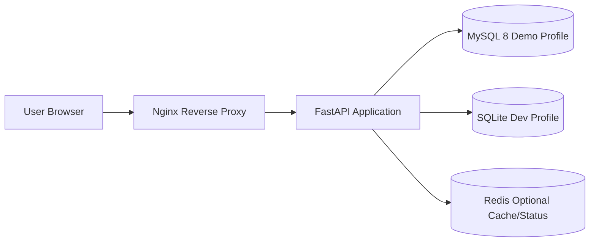
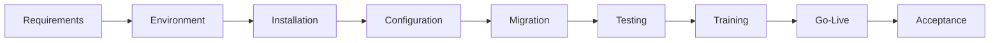

# Manufacturing ERP Implementation Delivery Lab

A hands-on ERP implementation laboratory covering deployment, MySQL, Linux, data migration, API integration, troubleshooting, training and go-live delivery.

This is an independently built interview demonstration project / implementation lab. It is not a commercial customer production system. ERP business data is mock data.

## Architecture



## Implementation Flow



## Tech Stack

FastAPI, Python, SQLAlchemy, Pydantic, SQLite, MySQL 8, Redis, Nginx, Docker Compose, pytest and curl.

## Business Modules

- Customers
- Products
- Warehouses
- Inventory and inventory transactions
- Sales orders and order items
- Implementation tasks
- Issues
- Operation logs with request_id

## Core Business Flow

Customer -> sales order -> stock validation -> confirm order -> inventory deduction -> transaction record -> completion.

If stock is not enough, the order becomes `inventory_failed` and the system creates an open issue for follow-up.

## Quick Start

```bash
python -m pip install -r requirements.txt
uvicorn app.main:app --reload
```

Open:

- Dashboard: `http://127.0.0.1:8000/`
- Swagger: `http://127.0.0.1:8000/docs`
- Health: `http://127.0.0.1:8000/health`

## Docker Start

```bash
cp .env.example .env
docker compose up -d
docker compose ps
docker compose logs app
curl http://localhost/health
```

Services: app, mysql, redis and nginx. MySQL data is persisted in a Docker volume.

On Windows, if Docker Desktop is not installed, run PowerShell as Administrator:

```powershell
powershell -ExecutionPolicy Bypass -File scripts/install_docker_windows.ps1
powershell -ExecutionPolicy Bypass -File scripts/verify_full_stack.ps1
```

## API

All main APIs return:

```json
{"code":0,"message":"success","data":{}}
```

Key endpoints:

- `GET /api/dashboard`
- `GET /api/customers`, `POST /api/customers`
- `GET /api/products`
- `GET /api/inventory`
- `GET /api/orders`, `POST /api/orders`, `GET /api/orders/{id}`
- `GET /api/issues`, `POST /api/issues`, `PUT /api/issues/{id}`
- `GET /api/implementation/tasks`
- `POST /api/data/import`
- `GET /api/system/status`

## SQL Capability

The `sql/` directory contains MySQL schema, seed data, 20 interview SQL queries, indexes, views, backup/restore and troubleshooting notes.

## Data Migration

Mock CSV files are in `data/import/`.

```bash
python scripts/import_data.py --folder data/import
```

The script checks required fields, duplicates, encoding assumptions, data types and foreign references. Results are written to `logs/import.log`.

## Linux Capability

Linux scripts are under `deploy/linux/`:

- `environment_check.sh`
- `install.sh`
- `start.sh`
- `stop.sh`
- `restart.sh`
- `health_check.sh`
- `backup.sh`
- `restore.sh`

## Testing

```bash
pytest -q
```

Latest local result: `9 passed` on 2026-07-31.

## Interview Boundary

Correct statement: I do not claim this is a real customer production ERP project. It is an implementation lab I built independently to practice ERP delivery workflow, SQL, deployment, migration, API verification, logging, troubleshooting, training and go-live acceptance.

## Important Documents

- `docs/CURRENT_STATE.md`
- `docs/DATA_MIGRATION_GUIDE.md`
- `docs/LINUX_DEPLOYMENT.md`
- `docs/TROUBLESHOOTING_PLAYBOOK.md`
- `docs/BACKUP_RESTORE.md`
- `docs/GO_LIVE_CHECKLIST.md`
- `docs/DOCKER_FULL_STACK_VERIFICATION.md`
- `INTERVIEW_GUIDE.md`
- `DEMO_SCRIPT.md`
- `EVIDENCE.md`
- `FINAL_ACCEPTANCE_REPORT.md`
