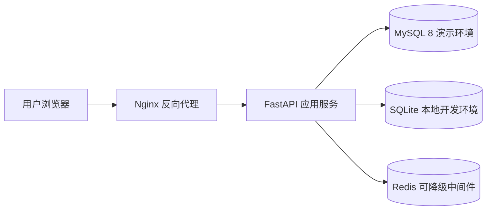

# 制造业 ERP 实施交付实验室

[](https://github.com/yangzhenheng/ERP-Implementation-Delivery-Lab/actions/workflows/ci.yml)

这是一个面向国内 ERP / 软件实施工程师岗位面试的个人实战项目，用于演示从需求调研、环境检查、安装部署、数据迁移、SQL 核对、接口联调、日志排查、客户培训到上线验收的完整实施交付流程。

项目英文仓库名保留为 `ERP-Implementation-Delivery-Lab`，中文正式名称为 **制造业 ERP 实施交付实验室**。

## 项目定位

- 这是个人独立搭建的实施演示项目，不是商业客户生产项目。
- 项目中的 ERP 业务数据均为模拟数据，不代表真实企业数据。
- 项目重点不是炫酷页面，而是证明实施工程师需要的 SQL、Linux、部署、数据迁移、接口验证、日志排查、问题跟踪和交付文档能力。
- 面试时可以诚实说明：没有把它包装成真实客户项目，而是用可运行系统证明自己理解实施工作闭环。

## 当前状态

- FastAPI + SQLite 本地演示模式：已验证。
- 自动化测试：已验证，最新结果 `9 passed`。
- CSV 数据导入：已验证并纳入 API 测试。
- Docker Compose 配置：已完成并通过 YAML 结构检查。
- MySQL / Redis / Nginx 容器运行：配置已完成，受当前电脑 Docker 环境限制，需安装 Docker Desktop 后执行全栈验收脚本。

## 系统架构



## 实施流程


## 技术栈

- 后端：FastAPI、Pydantic、SQLAlchemy
- 数据库：SQLite 本地模式、MySQL 8 演示模式
- 中间件：Redis 可选状态检查 / 缓存降级示例
- 部署：Docker Compose、Nginx、Linux Shell、systemd 示例
- 测试：pytest、FastAPI TestClient、HTTP 验证脚本
- 文档：实施计划、部署手册、迁移方案、故障手册、培训话术、验收报告

## 业务模块

- 客户管理
- 产品管理
- 仓库管理
- 库存管理与库存流水
- 销售订单与订单明细
- 实施任务
- 问题工单
- 操作日志与 request_id 追踪

## 核心业务闭环

客户 -> 销售订单 -> 库存校验 -> 库存足够 -> 订单确认 -> 库存扣减 -> 库存流水 -> 完成。

库存不足时，系统不会假装成功，而是将订单标记为 `inventory_failed`，并生成问题工单，体现实施现场常见的业务异常处理思路。

## 快速启动

```bash
python -m pip install -r requirements.txt
uvicorn app.main:app --reload
```

访问地址：

- 系统首页：`http://127.0.0.1:8000/`
- Swagger 接口文档：`http://127.0.0.1:8000/docs`
- 健康检查：`http://127.0.0.1:8000/health`

## Docker 启动

```bash
cp .env.example .env
docker compose up -d
docker compose ps
docker compose logs app
curl http://localhost/health
```

服务包括：`app`、`mysql`、`redis`、`nginx`。MySQL 数据通过 Docker volume 持久化。

Windows 如果尚未安装 Docker Desktop，请使用管理员 PowerShell：

```powershell
powershell -ExecutionPolicy Bypass -File scripts/install_docker_windows.ps1
powershell -ExecutionPolicy Bypass -File scripts/verify_full_stack.ps1
```

## API 规范

主要接口统一返回：

```json
{"code":0,"message":"success","data":{}}
```

核心接口：

- `GET /api/dashboard`
- `GET /api/customers`
- `POST /api/customers`
- `GET /api/products`
- `GET /api/inventory`
- `GET /api/orders`
- `POST /api/orders`
- `GET /api/orders/{id}`
- `GET /api/issues`
- `POST /api/issues`
- `PUT /api/issues/{id}`
- `GET /api/implementation/tasks`
- `POST /api/data/import`
- `GET /api/system/status`

## SQL 能力展示

`sql/` 目录包含：

- MySQL 8 建表脚本
- 初始化数据
- 20 条实施工程师面试 SQL
- 索引示例
- 视图示例
- MySQL 备份恢复说明
- MySQL 常见故障排查说明

覆盖 `SELECT`、`WHERE`、`ORDER BY`、`GROUP BY`、`HAVING`、`JOIN`、聚合函数、`CASE WHEN`、子查询、日期查询、NULL 处理、`INSERT`、`UPDATE`、`DELETE`、视图和索引优化。

## 数据迁移

模拟 CSV 数据位于 `data/import/`。

```bash
python scripts/import_data.py --folder data/import
```

导入脚本会检查必填字段、重复编码、数据类型、关联字段和错误行，并将结果写入 `logs/import.log`。

## 质量门禁

```bash
pytest -q
python -m compileall app scripts tests
python scripts/verify_deployment.py --base-url http://127.0.0.1:8000
```

Docker 环境可用时：

```bash
docker compose config --quiet
powershell -ExecutionPolicy Bypass -File scripts/verify_full_stack.ps1
```

## 目录结构

```text
app/                  FastAPI 应用、数据模型、前端驾驶舱
data/import/          数据迁移模拟 CSV
deploy/               Nginx、systemd、Linux 部署脚本
docs/                 实施、迁移、上线、排障和培训文档
scripts/              导入、验证、Docker、MySQL 辅助脚本
sql/                  建表、初始化、查询、索引、视图、备份恢复
tests/                pytest 自动化测试
troubleshooting/      可恢复的本地故障演练案例
```

## 面试讲解边界

推荐表述：

> 这个项目不是我参与过的真实客户生产系统，而是我独立搭建的 ERP 实施交付实验室。项目中的数据是模拟数据，但 FastAPI、SQLAlchemy、SQLite、MySQL 脚本、数据导入、接口测试、日志排查、Docker/Nginx 配置和实施文档都是我实际搭建和验证的内容。它用于证明我理解实施工程师从需求到上线验收的完整工作流程。

## 重点文档

- `INTERVIEW_GUIDE.md`
- `DEMO_SCRIPT.md`
- `EVIDENCE.md`
- `FINAL_ACCEPTANCE_REPORT.md`
- `docs/CURRENT_STATE.md`
- `docs/DATA_MIGRATION_GUIDE.md`
- `docs/LINUX_DEPLOYMENT.md`
- `docs/GO_LIVE_CHECKLIST.md`
- `docs/TROUBLESHOOTING_PLAYBOOK.md`
- `docs/DOCKER_FULL_STACK_VERIFICATION.md`
